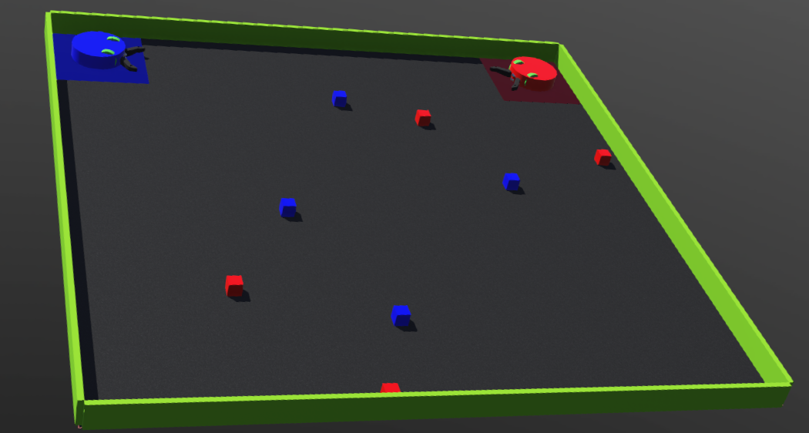

# RobotRL
Applying Reinforcement learning to a robot to solve block collection Task. Blue bot needs to collect blue blocks and Red bot needs to collect red blocks. Bots lose points if they touch each other or blocks of the wrong colour.

   

